# Hi 👋, I'm Ross Zhu
Full-Stack Engineer · AI Researcher · Independent Builder

🎓 M.S. in Computer Science @ University of Southern California (USC)

🌎 Based in Los Angeles

🚀 Building products across AI, Web, Mobile, and Games

🌐 Portfolio: [rosszhu.org](https://rosszhu.org)

---

# About Me

I'm a software engineer and researcher passionate about turning ideas into products.

My interests span:

- 🤖 Artificial Intelligence & Machine Learning
- 🌐 Full-Stack Web Development
- 📱 Mobile Application Development
- 🎮 Game Development
- ☁️ Cloud & Distributed Systems
- 🏗 Product Design & Entrepreneurship

I enjoy working at the intersection of research and engineering, transforming cutting-edge ideas into real-world applications.

---

<h3 align="left">Languages and Tools:</h3>

                                                                

---

---
